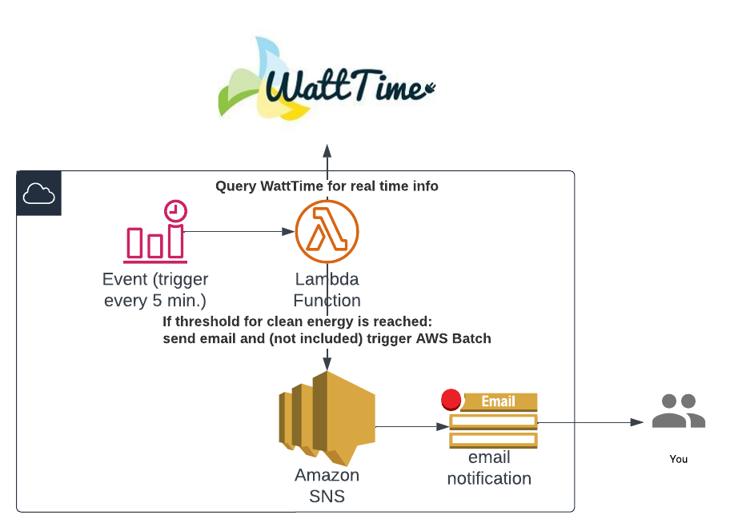

# Reduce c02 for AWS Batch with load-shifting

This application demonstrates the use of the WattTime API to strategically trigger AWS Batch jobs at sustainability-optimized times. By doing so, it helps reduce CO2 emissions based on the electrical grid load, ultimately contributing to a more environmentally friendly operation.

This project contains an AWS CDK application that deploys a Lambda function to monitor WattTime's real-time marginal emission rates and trigger an AWS Batch job (simulated with an SNS email) when the emission rate is below a specified threshold.

While free users have access to real-time data, consider upgrading to a paid tier for production use, as access to historical data can help you determine the optimal threshold for triggering AWS Batch jobs more effectively.

**Limitations:**
- Fine grained grid data is only available for the US
- Outside of the US only on country level
- Free tier of the API allows only for real time data
- If your threshold has not been crossed, your Batch job didn't run for the day.

### Architecture in this demo
To demonstrate the concept I left out the AWS Batch job to reduce complexity in the stack and simulated it with an SNS email that triggers as a notification.


### Setup before deployment

To use this stack yourself you have to execute a few short tasks to sign up to the WattTime API.
Here is the documentation, that is very straight forward if you are running into problems: 
https://www.watttime.org/api-documentation/#register-new-user

1. Open the directory /watttimesetup
2. Modify /register.py with your username, password, org and email.
3. Run the python script /register.py locally once to sign up to the api.
4. In the AWS region you want to deploy the stack, add the WattTime API credentials to the AWS Systems Manager Parameter Store as secure strings:
``/wattime/username``
``/wattime/password``
These get pulled in by the lambda function as credentials for the login.
### Lambda 
Last two steps before deployment and you are ready to go:
1. Open /lambda/index.py and replace the following variables.
[Get your location here](https://www.watttime.org/api-documentation/#determine-grid-region) or use one of the samples:
- BA = "IE" for Ireland
- BA = "DE" for Germany

1. Set the desired grid region in the Lambda function code by modifying the **BA** variable.

2. Set the emission rate threshold in the Lambda function code by modifying the **THRESHOLD** variable.
The threshold is a number from 0 to 100 and compares how clean your energy mix is. 0 cleanest to 100 dirtiest.
More info here: [Real time emissions](https://www.watttime.org/api-documentation/#real-time-emissions-index)

### Deployment

1. Clone the repository:

```bash
git clone https://github.com/your-repo/wattimeawsbatch.git
cd wattimeawsbatch
```


Install the required dependencies:
```npm install```

Deploy the stack:

```cdk deploy```